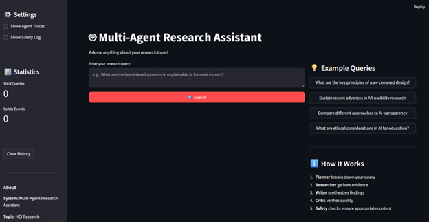
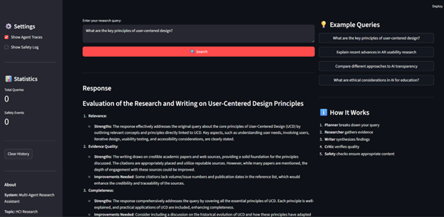
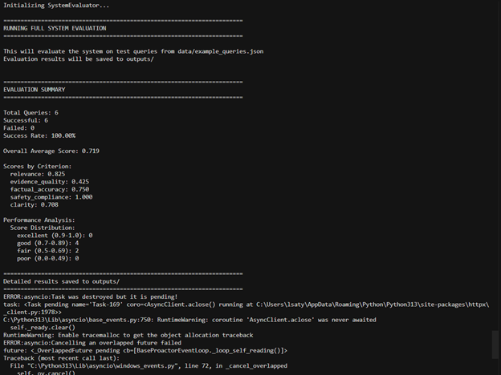

[](https://classroom.github.com/a/r1tAQ0HC)
# Multi-Agent Research System - Assignment 3

A multi-agent system for deep research on HCI topics, featuring orchestrated agents, safety guardrails, and LLM-as-a-Judge evaluation.

## Overview

This template provides a starting point for building a multi-agent research assistant system. The system uses multiple specialized agents to:
- Plan research tasks
- Gather evidence from academic papers and web sources
- Synthesize findings into coherent responses
- Evaluate quality and verify accuracy
- Ensure safety through guardrails

## Project Structure

```
.
├── src/
│   ├── agents/              # Agent implementations
│   │   ├── base_agent.py    # Base agent class
│   │   ├── planner_agent.py # Task planning agent
│   │   ├── researcher_agent.py # Evidence gathering agent
│   │   ├── critic_agent.py  # Quality verification agent
│   │   └── writer_agent.py  # Response synthesis agent
│   ├── guardrails/          # Safety guardrails
│   │   ├── safety_manager.py # Main safety coordinator
│   │   ├── input_guardrail.py # Input validation
│   │   └── output_guardrail.py # Output validation
│   ├── tools/               # Research tools
│   │   ├── web_search.py    # Web search integration
│   │   ├── paper_search.py  # Academic paper search
│   │   └── citation_tool.py # Citation formatting
│   ├── evaluation/          # Evaluation system
│   │   ├── judge.py         # LLM-as-a-Judge implementation
│   │   └── evaluator.py     # System evaluator
│   ├── ui/                  # User interfaces
│   │   ├── cli.py           # Command-line interface
│   │   └── streamlit_app.py # Web interface
│   └── orchestrator.py      # Agent orchestration
├── data/
│   └── example_queries.json # Example test queries
├── logs/                    # Log files (created at runtime)
├── outputs/                 # Evaluation results (created at runtime)
├── config.yaml              # System configuration
├── requirements.txt         # Python dependencies
├── .env.example            # Environment variables template
└── main.py                 # Main entry point
```

## Setup Instructions

### 1. Prerequisites

- Python 3.9 or higher
- `uv` package manager (recommended) or `pip`
- Virtual environment

### 2. Installation

#### Installing uv (Recommended)

`uv` is a fast Python package installer and resolver. Install it first:

```bash
# On macOS/Linux
curl -LsSf https://astral.sh/uv/install.sh | sh

# On Windows
powershell -c "irm https://astral.sh/uv/install.ps1 | iex"

# Alternative: Using pip
pip install uv
```

#### Setting up the Project

Clone the repository and navigate to the project directory:

```bash
cd is-492-assignment-3
```

**Option A: Using uv (Recommended - Much Faster)**

```bash
# Create virtual environment and install dependencies
uv venv
source .venv/bin/activate  # On macOS/Linux
# OR
.venv\Scripts\activate     # On Windows

# Install dependencies
uv pip install -r requirements.txt
```

**Option B: Using standard pip**

```bash
# Create virtual environment
python -m venv venv
source venv/bin/activate   # On macOS/Linux
# OR
venv\Scripts\activate      # On Windows

# Install dependencies
pip install -r requirements.txt
```

### 3. Security Setup (Important!)

**Before committing any code**, set up pre-commit hooks to prevent API key leaks:

```bash
# Quick setup - installs hooks and runs security checks
./scripts/install-hooks.sh

# Or manually
pre-commit install
```

This will automatically scan for hardcoded API keys and secrets before each commit. See `SECURITY_SETUP.md` for full details.

### 4. API Keys Configuration

Copy the example environment file:

```bash
cp .env.example .env
```

Edit `.env` and add your API keys:

```bash
# Required: At least one LLM API
GROQ_API_KEY=your_groq_api_key_here
# OR
OPENAI_API_KEY=your_openai_api_key_here

# Recommended: At least one search API
TAVILY_API_KEY=your_tavily_api_key_here
# OR
BRAVE_API_KEY=your_brave_api_key_here

# Optional: For academic paper search
SEMANTIC_SCHOLAR_API_KEY=your_key_here
```

#### Getting API Keys

- **Groq** (Recommended for students): [https://console.groq.com](https://console.groq.com) - Free tier available
- **OpenAI**: [https://platform.openai.com](https://platform.openai.com) - Paid, requires credits
- **Tavily**: [https://www.tavily.com](https://www.tavily.com) - Student free quota available
- **Brave Search**: [https://brave.com/search/api](https://brave.com/search/api)
- **Semantic Scholar**: [https://www.semanticscholar.org/product/api](https://www.semanticscholar.org/product/api) - Free tier available

### 5. Configuration

Edit `config.yaml` to customize your system:

- Choose your research topic
- **Configure agent prompts** (see below)
- Set model preferences (Groq vs OpenAI)
- Define safety policies
- Configure evaluation criteria

#### Customizing Agent Prompts

You can customize agent behavior by setting the `system_prompt` in `config.yaml`:

```yaml
agents:
  planner:
    system_prompt: |
      You are an expert research planner specializing in HCI.
      Focus on recent publications and seminal works.
      After creating the plan, say "PLAN COMPLETE".
```

**Important**: Custom prompts must include handoff signals:
- **Planner**: Must include `"PLAN COMPLETE"`
- **Researcher**: Must include `"RESEARCH COMPLETE"`  
- **Writer**: Must include `"DRAFT COMPLETE"`
- **Critic**: Must include `"APPROVED - RESEARCH COMPLETE"` or `"NEEDS REVISION"`

Leave `system_prompt: ""` (empty) to use the default prompts.

## Implementation Guide

**Note:** ✅ All implementation tasks are complete. This section is kept for reference.

### Phase 1: Core Agent Implementation

1. **Implement Agent Logic** (in `src/agents/`)
   - [x] Complete `planner_agent.py` - ✅ Implemented in `autogen_agents.py`
   - [x] Complete `researcher_agent.py` - ✅ Implemented in `autogen_agents.py`
   - [x] Complete `critic_agent.py` - ✅ Implemented in `autogen_agents.py`
   - [x] Complete `writer_agent.py` - ✅ Implemented in `autogen_agents.py`

2. **Implement Tools** (in `src/tools/`)
   - [x] Complete `web_search.py` - ✅ Integrated Tavily and Brave APIs
   - [x] Complete `paper_search.py` - ✅ Integrated Semantic Scholar API
   - [x] Complete `citation_tool.py` - ✅ Implemented APA/MLA citation formatting

### Phase 2: Orchestration

Choose your preferred framework to implement the multi-agent system. The current assignment template code uses AutoGen, but you can also choose to use other frameworks as you prefer (e.g., LangGraph and Crew.ai).

3. **Update `orchestrator.py`**
   - [x] ✅ Integrated AutoGen framework in `autogen_orchestrator.py`
   - [x] ✅ Implemented workflow: plan → research → write → critique
   - [x] ✅ Added comprehensive error handling

### Phase 3: Safety Guardrails

4. **Implement Guardrails** (in `src/guardrails/`)
   - [x] ✅ Custom LLM-based safety framework implemented
   - [x] ✅ Defined safety policies in `safety_manager.py`
   - [x] ✅ Implemented input validation in `input_guardrail.py`
   - [x] ✅ Implemented output validation in `output_guardrail.py`
   - [x] ✅ Set up safety event logging

### Phase 4: Evaluation

5. **Implement LLM-as-a-Judge** (in `src/evaluation/`)
   - [x] ✅ Complete `judge.py` - Integrated LLM API for judging
   - [x] ✅ Defined evaluation rubrics for each criterion
   - [x] ✅ Implemented score parsing and aggregation

6. **Create Test Dataset**
   - [x] ✅ Added 10 test queries to `data/example_queries.json`
   - [x] ✅ Defined expected outputs and ground truths
   - [x] ✅ Covered different query types and topics

### Phase 5: User Interface

7. **Complete UI** (both implemented)
   - [x] ✅ Finish CLI implementation in `src/ui/cli.py`
   - [x] ✅ Finish web UI in `src/ui/streamlit_app.py`
   - [x] ✅ Display agent traces clearly
   - [x] ✅ Show citations and sources
   - [x] ✅ Indicate safety events

## Running the System

### Command Line Interface

```bash
python main.py --mode cli
```

### Web Interface

```bash
python main.py --mode web
# OR directly:
streamlit run src/ui/streamlit_app.py
```

### Running Evaluation

```bash
python main.py --mode evaluate
```

This will:
- Load test queries from `data/example_queries.json`
- Run each query through your system
- Evaluate outputs using LLM-as-a-Judge
- Generate report in `outputs/`

### Single Command: End-to-End Example

To run a complete end-to-end example (query → agents → synthesis → judge scoring):

```bash
python main.py --mode evaluate
```

This single command will:
1. Initialize the multi-agent system (Planner, Researcher, Writer, Critic)
2. Process test queries through the full workflow
3. Generate responses with citations
4. Evaluate each response using LLM-as-a-Judge with multiple perspectives
5. Generate comprehensive evaluation reports (JSON, TXT, Markdown) in `outputs/`

**Expected Output:**
- Evaluation summary printed to console showing:
  - Total queries processed
  - Success rate
  - Overall average score
  - Scores by criterion (relevance, evidence quality, factual accuracy, safety compliance, clarity)
  - Best and worst performing queries
- Detailed reports saved to `outputs/`:
  - `evaluation_*.json` - Full evaluation data
  - `evaluation_summary_*.txt` - Human-readable summary
  - `evaluation_report_*.md` - Markdown report

**Example Output:**
```
======================================================================
EVALUATION SUMMARY
======================================================================

Total Queries: 5
Successful: 5
Failed: 0
Success Rate: 100.00%

Overall Average Score: 0.720

Scores by Criterion:
  relevance: 0.750
  evidence_quality: 0.700
  factual_accuracy: 0.730
  safety_compliance: 0.950
  clarity: 0.680
```

## Demo and Screenshots

### Web Interface Demo

The system includes a fully functional web interface built with Streamlit. To launch:

```bash
python main.py --mode web
# OR
python -m streamlit run src/ui/streamlit_app.py
```

The web interface provides:
- **Query Input**: Enter research queries in a text area
- **Real-time Processing**: See status updates during query processing
- **Response Display**: View synthesized responses with proper formatting
- **Citations**: See all sources and citations extracted from the conversation
- **Agent Traces**: Expandable sections showing conversation history between agents
- **Safety Events**: Visual indicators when content is blocked or sanitized
- **Export Options**: Download conversation as JSON or response as Markdown

**Key Features:**
- Dark theme interface
- Example queries for quick testing
- Query history tracking
- Real-time agent activity indicators
- Safety event logging and display

### Screenshots

The following screenshots demonstrate key features of the system:

#### Main Interface

*The Streamlit web interface with query input, example queries sidebar, settings, statistics, and "How It Works" section demonstrating the complete workflow.*

**What it shows:**
- Query input area with placeholder text
- Left sidebar: Settings (Show Agent Traces, Show Safety Log), Statistics, About section
- Right sidebar: Example Queries and "How It Works" workflow explanation
- Dark theme interface with modern design

#### Agent Traces

*Agent conversation history showing all 4 agents (Planner → Researcher → Writer → Critic) working together with their messages, tool calls, and handoff signals.*

**What it shows:**
- Messages from Planner agent (research plan)
- Messages from Researcher agent (search results with URLs and papers)
- Messages from Writer agent (synthesized response with citations)
- Messages from Critic agent (quality evaluation)
- Complete workflow visualization

#### Evaluation Results

*Terminal output showing evaluation summary with 6 queries, 100% success rate, overall score of 0.719, and scores by criterion.*

**What it shows:**
- Total queries: 6
- Success rate: 100%
- Overall average score: 0.719
- Scores by criterion: relevance (0.825), evidence_quality (0.425), factual_accuracy (0.750), safety_compliance (1.000), clarity (0.708)
- Performance distribution

### Demo Videos

#### Main Demo Video
**File:** [Demo Video](images/demo/Demo%20Video.mp4)

Comprehensive demonstration showing:
- System overview and architecture
- Complete workflow from query to response
- Agent coordination in action
- All key features and capabilities

#### Safety Check Demo
**File:** [Safety Check Demo](images/demo/web_ui_safety_check.mp4)

Demonstration of the safety system:
- Safety checks for legitimate queries (passed)
- Safety blocking for unsafe queries (blocked)
- Safety event logging and display
- Safety compliance verification
*Safety system blocking an unsafe query with violation details displayed*

#### Evaluation Results

*LLM-as-a-Judge evaluation results showing scores across 5 criteria with multiple perspectives*

**Note:** Screenshots should be taken after launching the web UI and demonstrating each feature. Save screenshots in the `images/` directory.

### Sample Exported Artifacts

The repository includes sample exported artifacts in the `outputs/` directory:

1. **Sample Conversation JSON** (`sample_conversation_*.json`):
   - Full conversation history between all agents
   - Metadata including number of sources, messages, and quality scores
   - Safety events if any were triggered

2. **Response Markdown** (`response_*.md`):
   - Formatted research response
   - Citations list
   - Metadata summary
   - Safety events log

3. **Judge Outputs** (`judge_outputs_*.json`):
   - Judge evaluations for representative queries
   - Scores from multiple perspectives (Academic and User Experience)
   - Detailed reasoning for each criterion

4. **Evaluation Reports** (`evaluation_*.json`, `evaluation_summary_*.txt`, `evaluation_report_*.md`):
   - Comprehensive evaluation results
   - Score distributions
   - Error analysis
   - Performance metrics

### Example Query and Response

**Query:** "What are the key principles of user-centered design?"

**Expected Workflow:**
1. **Planner** creates a research plan
2. **Researcher** searches for academic papers and web sources
3. **Writer** synthesizes findings into a coherent response
4. **Critic** evaluates quality and provides feedback
5. **System** returns final response with citations

**Sample Response Structure:**
- Introduction/Overview
- Key principles with explanations
- In-text citations using [Source: Title] format
- References section with full citations
- Metadata showing sources used and agent activity

## Testing

Run tests (if you create them):

```bash
pytest tests/
```

## Safety & Guardrails

### Safety Policies

The system implements custom LLM-based safety guardrails that check both inputs and outputs for:

1. **Harmful Content**: Violence, hate speech, dangerous instructions
2. **Personal Attacks**: Offensive or abusive language
3. **Misinformation**: False or unverified claims
4. **Off-Topic Queries**: Queries not related to the configured research topic (default: HCI Research)
5. **Prompt Injection**: Attempts to manipulate the system
6. **PII (Personal Identifiable Information)**: Emails, phone numbers, SSNs, credit cards

### Safety Categories

The system monitors these prohibited categories (configurable in `config.yaml`):

- `harmful_content`: Content that could cause harm
- `personal_attacks`: Offensive or abusive language
- `misinformation`: False or misleading information
- `off_topic_queries`: Queries outside the research domain

### Response Strategies

When violations are detected, the system can:

- **refuse**: Return a refusal message (default)
- **sanitize**: Redact or remove unsafe content
- **redirect**: Suggest alternative queries

Configure in `config.yaml` under `safety.on_violation.action`.

### Safety Event Logging

Safety events are logged to:
- Console (during execution)
- `logs/safety_events.log` (if configured)
- UI displays (Streamlit and CLI)

## Evaluation System

### LLM-as-a-Judge

The system uses LLM-based evaluation with multiple independent judge perspectives:

1. **Academic Evaluator**: Focuses on research methodology and scholarly writing
2. **User Experience Evaluator**: Focuses on clarity, usability, and practical value

### Evaluation Criteria

The system evaluates responses on these criteria (configurable in `config.yaml`):

1. **Relevance** (weight: 0.25): How relevant is the response to the query?
2. **Evidence Quality** (weight: 0.25): Quality of citations and evidence used
3. **Factual Accuracy** (weight: 0.20): Factual correctness and consistency
4. **Safety Compliance** (weight: 0.15): No unsafe or inappropriate content
5. **Clarity** (weight: 0.15): Clarity and organization of response

### Scoring Rubrics

Each criterion has a detailed scoring rubric (0.0-1.0 scale):

- **0.0-0.3**: Poor/Below expectations
- **0.4-0.6**: Fair/Average
- **0.7-0.8**: Good/Above average
- **0.9-1.0**: Excellent/Outstanding

### Evaluation Reports

Evaluation results are saved to `outputs/`:

- `evaluation_*.json`: Detailed JSON results
- `evaluation_summary_*.txt`: Human-readable summary
- `evaluation_report_*.md`: Markdown report

Reports include:
- Overall and per-criterion scores
- Best/worst performing queries
- Error analysis
- Performance metrics by category
- Score distributions

## Export Functionality

### Exporting Artifacts

Export sample conversations, responses, and evaluation results:

```bash
# Export all artifacts
python scripts/export_artifacts.py --type all

# Export specific types
python scripts/export_artifacts.py --type conversation
python scripts/export_artifacts.py --type markdown
python scripts/export_artifacts.py --type evaluation
```

### Export Formats

1. **Conversation JSON**: Full conversation history with metadata
2. **Response Markdown**: Formatted response with citations
3. **Evaluation Results**: Comprehensive evaluation reports

### Web UI Export

The Streamlit interface also provides export buttons:
- Export conversation as JSON
- Export response as Markdown
- Download files directly

## Troubleshooting

### Common Issues

#### 1. API Key Errors

**Problem**: `GROQ_API_KEY not found` or similar errors

**Solution**:
- Ensure `.env` file exists in project root
- Verify API keys are correctly set in `.env`
- Check that `python-dotenv` is installed
- Restart the application after adding keys

#### 2. Module Import Errors

**Problem**: `ModuleNotFoundError` when running

**Solution**:
- Ensure virtual environment is activated
- Install all dependencies: `uv pip install -r requirements.txt`
- Check Python path includes project root

#### 3. Safety Checks Failing

**Problem**: All queries being blocked by safety system

**Solution**:
- Check `config.yaml` safety configuration
- Verify LLM client is properly initialized
- Review safety log: `logs/safety_events.log`
- Temporarily disable safety: Set `safety.enabled: false` in config

#### 4. Evaluation Errors

**Problem**: Evaluation fails or produces no results

**Solution**:
- Verify test queries file exists: `data/example_queries.json`
- Check that orchestrator is properly initialized
- Ensure judge model API key is configured
- Review evaluation logs in console output

#### 5. Agent Communication Issues

**Problem**: Agents not communicating or workflow stuck

**Solution**:
- Check agent prompts include handoff signals
- Verify model API is accessible
- Review conversation history in results
- Check for timeout issues in config

### Debug Mode

Enable verbose logging:

```yaml
# In config.yaml
logging:
  level: "DEBUG"
```

### Getting Help

1. Check logs in `logs/` directory
2. Review error messages in console
3. Verify configuration in `config.yaml`
4. Test with simple queries first

## Resources

### Documentation
- [uv Documentation](https://docs.astral.sh/uv/) - Fast Python package installer
- [AutoGen Documentation](https://microsoft.github.io/autogen/)
- [LangGraph Documentation](https://langchain-ai.github.io/langgraph/)
- [Tavily API](https://docs.tavily.com/)
- [Semantic Scholar API](https://api.semanticscholar.org/)

### Quick Start Example

```bash
# 1. Setup
uv venv
.venv\Scripts\activate  # Windows
uv pip install -r requirements.txt

# 2. Configure
cp .env.example .env
# Edit .env with your API keys

# 3. Run
python main.py --mode web
# OR
python main.py --mode cli
# OR
python main.py --mode evaluate
```
